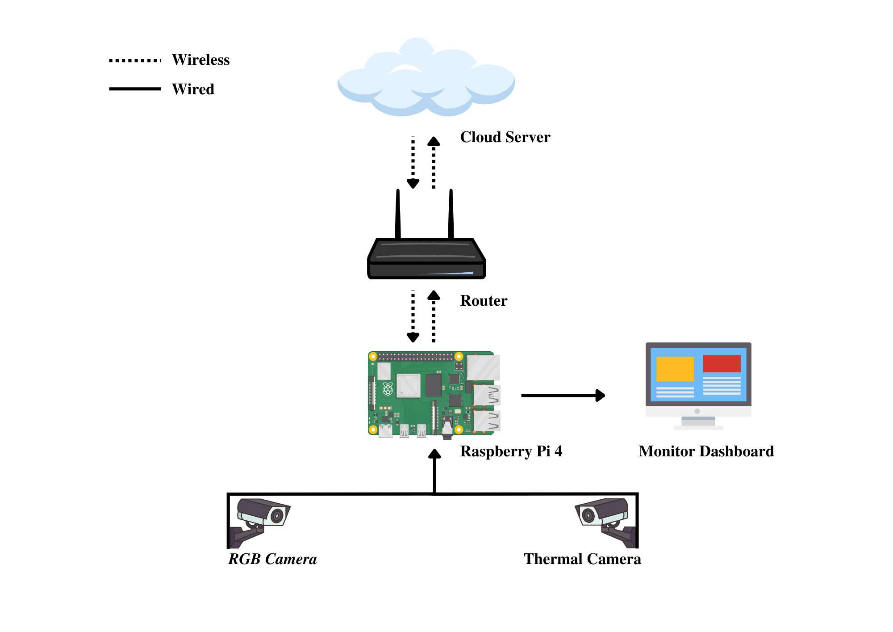
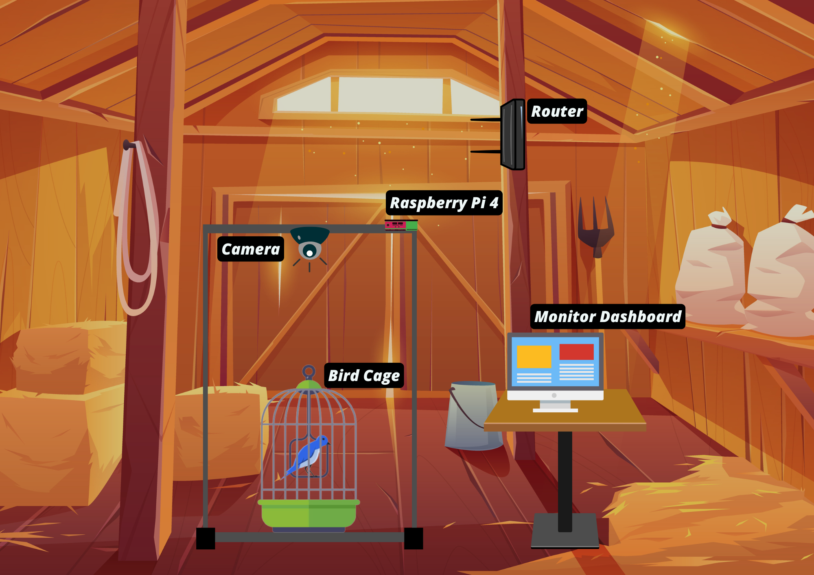
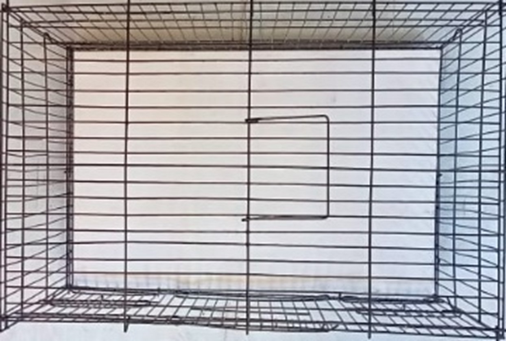
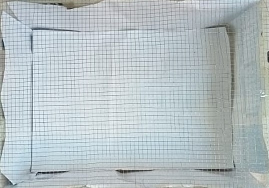
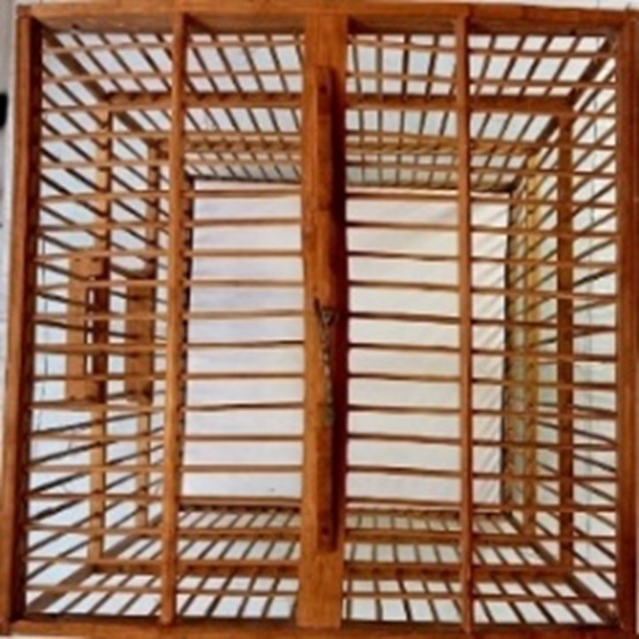
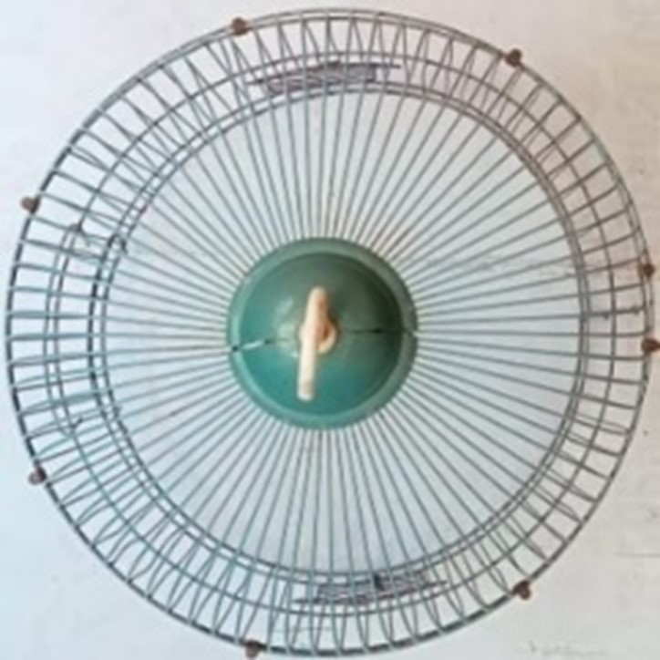
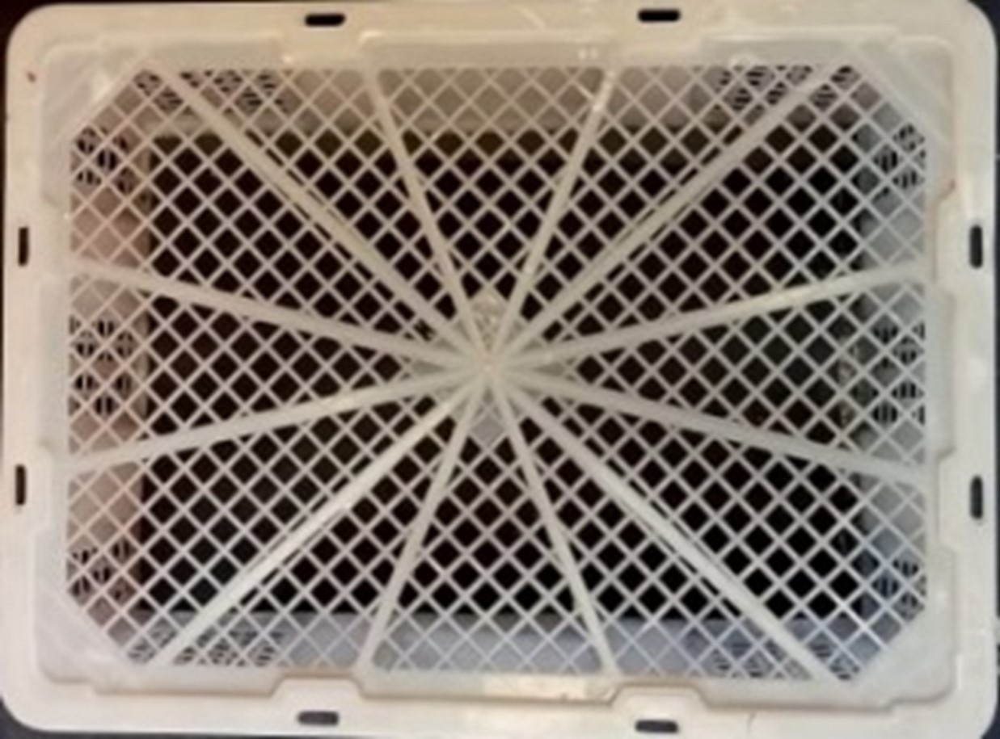
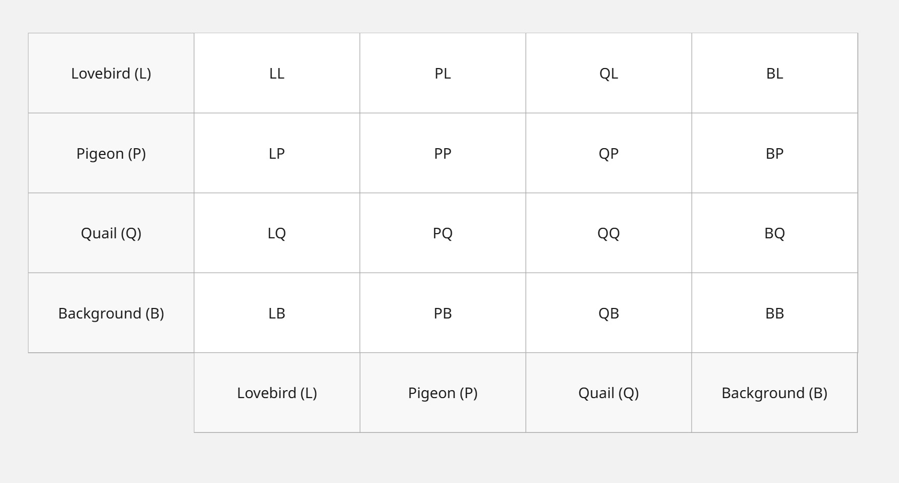

# 🐦 SYSTEM FOR CALCULATING NUMBERS AND CLASSIFICATION OF BIRD SPECIES IN CAGES IN WILDLIFE TRADE USING DEEP LEARNING ALGORITHMS

---

## 📑 Table of Contents
- [Overview](#-overview)
- [System Topology and Illustration](#-system-topology-and-illustration)
- [Data Preparation](#-data-preparation)
- [Cage Contour Measurement](#-cage-contour-measurement)
- [Evaluation](#-evaluation)
- [Conclusion](#-conclusion)
- [References](#-references)

---

## 📌 Overview

This research explores **real-time detection of birds in cages**, focusing on both the **number of birds** and their **species identification**.  
We adopt **YOLOv7**, a state-of-the-art real-time object detection framework, to perform detection under different imaging modalities.  

Two types of cameras are employed for image acquisition:
- **RGB Camera** — captures standard visual images.
- **Thermal Camera** — provides infrared imaging for detection in challenging lighting conditions.  

To assess performance, we introduce a **cage contour measurement technique**, which classifies cages based on the percentage of obstacles (from least to most obstructed).  
The performance of the detection model is then compared across both camera types under varying cage conditions.  

---

## 🗺️ System Topology and Illustration

### Topology
The topology below illustrates the overall data flow and system components.

  
*Figure 1. Proposed system topology for bird detection.*

This system is composed of the following components:
- **Camera Nodes** — RGB and Thermal cameras, wired to Raspberry Pi 4.  
- **Edge Device** — Raspberry Pi 4 handles initial preprocessing.  
- **Router** — Provides Wi-Fi connectivity to the cloud server.  
- **Cloud Server** — Executes YOLOv7 detection and classification.  
- **Dashboard** — Displays results returned to Raspberry Pi 4.  

**Workflow:**
1. RGB and Thermal cameras capture bird images inside the cage.  
2. Raspberry Pi 4 performs image preprocessing.  
3. Preprocessed data is transmitted to the cloud server via Wi-Fi.  
4. Cloud server runs YOLOv7 detection and species classification.  
5. Results are returned and displayed on the dashboard.  

### Illustration
  
*Figure 2. Hardware setup with RGB and Thermal cameras.*

---

## 📦 Data Preparation

### Data Collection
- **Environment:** Indoor setup at ~27 °C with sufficient light.  
- **Bird Species:** Three species.  
- **Cages:** Five types of cages (see Fig. 3 in the paper).  
- **Cage Covers:** Six materials tested:  
  1. LDPE plastic bags  
  2. HDPE plastic bags  
  3. Polyethylene foam  
  4. Polypropylene (PP) plastic bags  
  5. Cloth  
  6. Cardboard   

---

### Annotation & Labeling
- Annotation performed using **[Roboflow](https://roboflow.com/)**.  
- Methods: **Bounding Boxes** (object detection) and **Masking** (instance segmentation).  
- Target model: **YOLOv7**.  
- Labels contain class information and object coordinates.  

---

### Dataset Split
- **Training:** 80%  
- **Validation:** 10%  
- **Testing:** 10%  
- Training and validation images: primarily from *second cage type*.  

---

### Data Augmentation
- **RGB Data**: Horizontal & vertical flips, rotations (90°, 180°), brightness adjustment ±25%.  
- **Thermal Data**: Rotation only (no brightness adjustments).  

---

## 📐 Cage Contour Measurement

The cage contour measurement estimates how much of the cage view is obstructed by cage bars or covers.  
This ratio is later used to analyze how obstacle levels affect detection performance.

### 🔎 Pseudocode

#### Step 1: Read Input Image
image ← READ_IMAGE(image_path)

#### Step 2: Convert to Grayscale
gray_image ← CONVERT_TO_GRAYSCALE(image)

#### Step 3: Apply Binary Thresholding
binary_image ← APPLY_BINARY_THRESHOLD(gray_image)

#### Step 4: Count Pixels
total_pixels ← COUNT_TOTAL_PIXELS(binary_image)
black_pixels ← COUNT_PIXELS(binary_image, value = BLACK)
white_pixels ← COUNT_PIXELS(binary_image, value = WHITE)

#### Step 5: Calculate Ratios
black_ratio ← black_pixels / total_pixels
white_ratio ← white_pixels / total_pixels

#### Step 6: Return Results
RETURN black_ratio, white_ratio

---

### 🔎 Measurement Result

| Type | Cage Contour                                | Ratio  |
|------|---------------------------------------------|--------|
| 1    |  | 27.38% |
| 2    |  | 28.99% |
| 3    |  | 62.79% |
| 4    |  | 51.52% |
| 5    |  | 68.93% |

---

## 📈 Evaluation

We evaluate the model performance using a **confusion matrix**.

### 🔎 Confusion Matrix
Below is our confusion matrix format:

  
*Figure 3. Confusion matrix for bird detection.*

---

### 📊 Results

#### 🖼️ Using RGB Camera Without Cage Cover
<table>
  <tr>
    <th rowspan="2">Cage Type</th>
    <th colspan="3">F1 Score</th>
  </tr>
  <tr>
    <th>Th = 0.25</th>
    <th>Th = 0.50</th>
    <th>Th = 0.75</th>
  </tr>
  <tr>
    <td>1</td><td>92.10%</td><td>78.78%</td><td>59.64%</td>
  </tr>
  <tr>
    <td>2</td><td>97.50%</td><td>97.50%</td><td>97.50%</td>
  </tr>
  <tr>
    <td>3</td><td>0%</td><td>0%</td><td>0%</td>
  </tr>
  <tr>
    <td>4</td><td>0%</td><td>0%</td><td>0%</td>
  </tr>
  <tr>
    <td>5</td><td>0%</td><td>0%</td><td>0%</td>
  </tr>
</table>

---

#### 🌡️ Using Thermal Camera Without Cage Cover
<table>
  <tr>
    <th rowspan="2">Cage Type</th>
    <th colspan="3">F1 Score</th>
  </tr>
  <tr>
    <th>Th = 0.25</th>
    <th>Th = 0.50</th>
    <th>Th = 0.75</th>
  </tr>
  <tr>
    <td>1</td><td>96.87%</td><td>96.06%</td><td>96.06%</td>
  </tr>
  <tr>
    <td>2</td><td>96.69%</td><td>96.69%</td><td>97.91%</td>
  </tr>
  <tr>
    <td>3</td><td>43.75%</td><td>45.71%</td><td>50.00%</td>
  </tr>
  <tr>
    <td>4</td><td>75.75%</td><td>75.75%</td><td>75.75%</td>
  </tr>
  <tr>
    <td>5</td><td>92.30%</td><td>93.33%</td><td>93.33%</td>
  </tr>
</table>

---

#### 🌡️ Using Thermal Camera With Cage Cover
<table>
  <tr>
    <th rowspan="2">Cover Type</th>
    <th colspan="3">F1 Score</th>
  </tr>
  <tr>
    <th>Th = 0.25</th>
    <th>Th = 0.50</th>
    <th>Th = 0.75</th>
  </tr>
  <tr>
    <td>1</td><td>89.76%</td><td>89.25%</td><td>87.71%</td>
  </tr>
  <tr>
    <td>2</td><td>97.43%</td><td>97.43%</td><td>97.43%</td>
  </tr>
  <tr>
    <td>3</td><td>43.75%</td><td>45.71%</td><td>50.00%</td>
  </tr>
  <tr>
    <td>4</td><td>75.75%</td><td>75.75%</td><td>75.75%</td>
  </tr>
  <tr>
    <td>5</td><td>92.30%</td><td>93.33%</td><td>93.33%</td>
  </tr>
</table>

---

## ✅ Conclusion

- The **best RGB camera performance** was achieved in the **second cage**,  
  with an **F1 score of 97.5%**.  
- Using a **thermal camera** consistently improved detection accuracy compared to the RGB camera.  
- With the **RGB camera**, birds were not detected in **cages 3 to 5**.  
- With the **thermal camera**, birds were successfully detected even in the cage with the highest contour,  
  achieving an **F1 score of 93.33%** at all thresholds.  
- The **best thermal camera performance** occurred with a **HDPE plastic cover**,  
  yielding an **F1 score of 97.43%** at a threshold of 0.25.  

---

## 📚 References
- Wang, C.-Y., Bochkovskiy, A., & Liao, H.-Y. M. (2022).  
  *YOLOv7: Trainable bag-of-freebies sets new state-of-the-art for real-time object detectors.*  
  arXiv preprint arXiv:2207.02696.  
- Roboflow. [https://roboflow.com](https://roboflow.com)  

